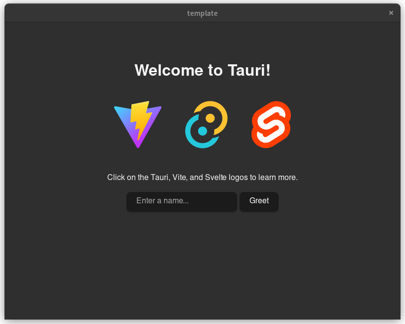

# Tauri mobile alpha + Android
The template is only tested to run on linux and build for linux/android.

## Warning

Tauri mobile is currently in alpha state. Please be aware that breaking changes may happen, thus making the newest version incompatible with previous ones. I'll try to do my best to keep this template up to date.

## Prerequisites

Follow the [Tauri mobile guide on setting up linux](https://next--tauri.netlify.app/next/guides/getting-started/prerequisites/linux)


After you have added the prequisites, get the tauri cli ( 2.0 alpha version):

```
cargo install tauri-cli --version "^2.0.0-alpha"
```

We also are using `pnpm`, so have that installed too, or use npm:

```
npm install -g pnpm
```

## Development

First, clone this repository or use the Github template feature. then, `cd` into
the project directory to perform the following steps:

Download project dependencies:

```
pnpm i
```

Run `tauri dev` to compile dependencies and verify that the app will run locally,
before attempting to run on mobile.

```
cargo tauri dev
```

you should see something similar to the following:




after verifying that the app can actually run, setup the mobile features:

```
pnpm add -D internal-ip
```

```
cargo tauri android init
```

To run the app using an android emulator, run the following (make sure you
do not have a physical android phone plugged in): 

```
cargo tauri android dev
```

Alternatively you can create a release build and copy it to your phone:

```
cargo tauri android build
```

this will create an apk file here: 

```
~/src-tauri/gen/android/app/build/outputs/apk/universal/release/app-universal-release-unsigned.apk
```

this file needs to be signed. you first need to generate a keystore file. Just
put in whatever you want during the prompts:

```
keytool -genkey -v -keystore release-keystore.jks -alias alias_name -keyalg RSA -keysize 2048 -validity 10000
```

I moved the `release-keystore.jks` file to `src-tauri/gen/android/`, though not
required. Then you can use that file to sign your app, note that you will need to
point to the `apksigner` that you installed with Android Studio in the 
prerequsite steps. you will also need to provide the absolute path to the `apk`
file generated by `cargo tauri android build`:

```
...../Android/Sdk/build-tools/34.0.0/apksigner sign --ks /home/casey/Documents/tauri/tauri-mobile-android/src-tauri/gen/android/release-keystore.jks ...../src-tauri/gen/android/app/build/outputs/apk/universal/release/app-universal-release-unsigned.apk
```


now plug in your android phone to your computer, allow file transfer, allow
the ability to install apps from the file manager, and cut through all the 
security warnings to install your app! 

you should see something like the following:


**success!**